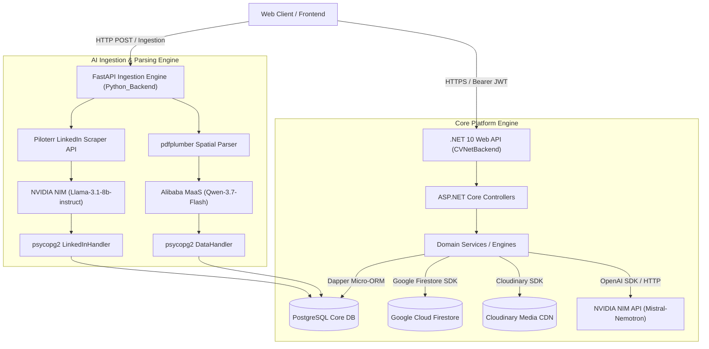
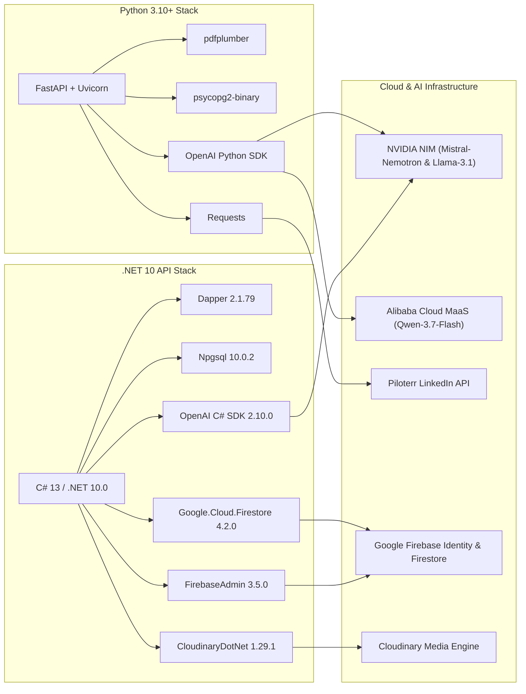
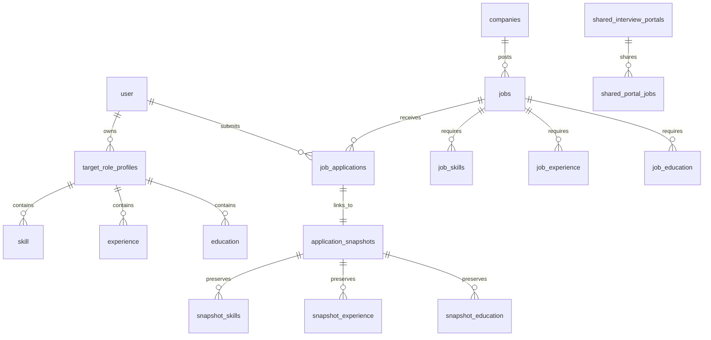
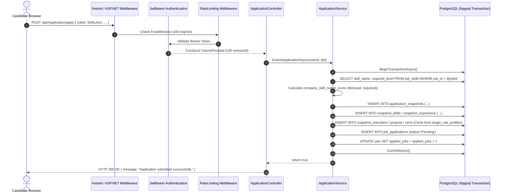
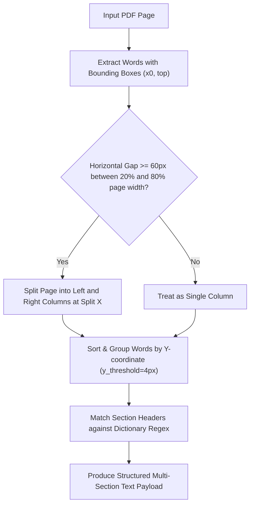

# CV.Net Backend

Welcome to the backend workspace of **CV.Net** — an AI-augmented talent acquisition and career optimization platform that helps candidates build stronger, tailored profiles and empowers companies with deterministic, multi-criteria hiring pipelines.

This repository contains:
- A **.NET Web API** for core business features, security, and profile management
- A **Python FastAPI service** for CV layout extraction, LinkedIn scraping, and LLM schema mapping
- **Firebase Data Connect & PostgreSQL** schema/config for relational database modeling
- **Google Cloud Firestore** for real-time authentication and role synchronization

---

## Table of Contents
1. [Project Structure](#project-structure)
2. [Technical Dossier & Architecture](#technical-dossier--architecture)
   - [1. Executive Summary & Architecture](#1-executive-summary--architecture)
   - [2. Deep-Dive Tech Stack & Dependencies](#2-deep-dive-tech-stack--dependencies)
   - [3. Object-Oriented Programming (OOP) & Design Patterns](#3-object-oriented-programming-oop--design-patterns)
   - [4. Data Layer, Security & Tenant Isolation](#4-data-layer-security--tenant-isolation)
   - [5. Concurrency, Performance & Memory Management](#5-concurrency-performance--memory-management)
   - [6. Edge Cases, Error Handling & Technical Trade-Offs](#6-edge-cases-error-handling--technical-trade-offs)
3. [Key File Index](#key-file-index)
4. [Getting Started (Clone and Run)](#getting-started-clone-and-run)
5. [Environment Configuration](#environment-configuration)
6. [Development Workflow](#development-workflow)

---

## Project Structure

```text
cv.Net-Backend/
├── Backend.sln                     # Visual Studio solution
├── CVNetBackend/                   # Main .NET backend API (net10.0)
│   ├── Program.cs                  # App startup, DI, auth, CORS, rate limit, Swagger
│   ├── Admin/                      # Admin-side endpoints/services
│   ├── Company_End/                # Company-side modules
│   │   ├── JobPost/                # Job creation & company profile
│   │   ├── JobManagement/          # Job listings & metrics
│   │   ├── ApplicationsView/       # Applicant reviews & actions
│   │   ├── Interviews/             # Scheduling & PIN-secured shared portals
│   │   ├── CandidateSection/       # Candidate discovery & filters
│   │   └── Dashboard/              # Recruiter analytics & charts
│   ├── User_End/                   # Candidate/user-side modules
│   │   ├── LoginManagement/        # Auth sync, signup, account wipe
│   │   ├── ProfileHandler/         # Profile media & details
│   │   ├── JobApply/               # Job discovery & snapshot application
│   │   ├── JobRoleManager/         # Target role profiles & skill matrix
│   │   ├── CVController/           # Raw CV Cloudinary uploads
│   │   ├── DashBoard/              # Candidate dashboard & track metrics
│   │   ├── Enhancer/               # NVIDIA NIM LLM career assistant
│   │   ├── SchemaHandler/          # Dynamic 14-table profile CRUD
│   │   ├── skill-gap/              # Skill gap mathematical engine
│   │   └── Services/               # Shared database & Firestore services
│   ├── appsettings.json            # Base app settings
│   └── appsettings.Development.json
├── Python_Backend/                 # AI-assisted CV + LinkedIn processing service
│   ├── main.py                     # Unified FastAPI entry point
│   ├── Cv_handle/                  # CV PDF spatial extraction + schema mapping + DB sync
│   │   ├── DataExtract.py          # Spatial gutter detection & column parsing
│   │   ├── service.py              # Alibaba MaaS Qwen-3.7-Flash LLM extraction
│   │   └── DataHandler.py          # psycopg2 relational batch writer
│   ├── fill_with_Linkedinn/        # LinkedIn scraping + mapping + DB merge
│   │   ├── scrape_linkedin.py      # Piloterr API client
│   │   ├── linkedin_service.py     # NVIDIA NIM Llama-3.1 LLM extraction
│   │   └── linkedin_data_handler.py# Incremental non-destructive merger
│   └── requirements.txt            # Python dependencies
├── dataconnect/                    # Firebase Data Connect config and schema
│   ├── dataconnect.yaml
│   ├── schema/schema.gql           # 14-table master schema definition
│   └── example/connector.yaml
├── API_Guide/                      # Internal text guides and algorithmic research
├── firebase.json                   # Firebase + Data Connect local config
└── .firebaserc                     # Firebase project alias
```

---

## Technical Dossier & Architecture

### 1. Executive Summary & Architecture

* **Core Functionality:**
  - **Candidates:** Create and maintain a foundational Master Profile and tailored Target Role Profiles. Ingest external resumes through spatial PDF extraction and LinkedIn URL scraping. Perform deterministic mathematical skill gap assessments against industry expectations, formalize text via LLM career assistants, and submit job applications.
  - **Recruiters / Companies:** Build verified company workspaces, configure multi-criteria job postings (skills with required levels, degree requirements, experience brackets), review applicants ranked by algorithmic match scores, schedule interviews, and generate time-bound, PIN-protected shared review portals for external hiring committees.
  - **Platform Administrators:** Manage role migrations (e.g., converting a candidate into a company workspace) and atomic cross-database user profile deletions.



* **Architecture Pattern:**
  - **Decoupled Dual-Engine Backend (Polyglot Microservices):** High-throughput, strongly-typed transaction processing handled by **C# / ASP.NET Core**, paired with an asynchronous **Python FastAPI** microservice dedicated to spatial PDF layout parsing, external web scraping, and zero-temperature LLM structured schema normalization.
  - **Layered Architecture & Polyglot Persistence:** Separation across Presentation (Controllers), Domain Business Logic (Services & Computation Engines), and Data Access (Dapper SQL + Firestore NoSQL + Cloudinary Media CDN), aligned with the GraphQL master schema in `dataconnect/schema/schema.gql`.
  - **Snapshot Pattern (Memento Variant):** Application submission freezes candidate data into immutable snapshot records, guaranteeing historical auditability regardless of subsequent live profile edits.

* **Component Breakdown & Inter-Module Communication:**
  - `CVNetBackend`: Primary REST API running on Kestrel. Authenticates incoming traffic via Firebase Auth JWT tokens, orchestrates business logic across Candidate, Company, and Admin modules, executes high-performance SQL queries via Dapper/Npgsql, and coordinates profile synchronization.
  - `Python_Backend`: Dedicated FastAPI extraction engine exposed on port `8000`. Receives document ingestion commands, fetches raw blobs from Cloudinary via HTTP streaming, executes coordinate-based layout extraction via `pdfplumber`, prompts cloud LLMs, and performs bulk upserts into PostgreSQL using `psycopg2.extras.execute_values`.
  - **Inter-service Communication:** Stateless HTTP/JSON REST APIs with CORS policy configurations enabling decoupled client consumption.

---

### 2. Deep-Dive Tech Stack & Dependencies



* **Core Languages & Runtimes:**
  - **C# 13 / .NET 10.0** (`TargetFramework net10.0` in `CVNetBackend.csproj`): Nullable reference types enabled, implicit global usings, top-level entry point in `Program.cs`.
  - **Python 3.10+**: Asynchronous execution via `uvicorn` ASGI runtime with `pydantic` request parsing in `Python_Backend/requirements.txt`.
* **Frameworks & Core Libraries:**
  - **ASP.NET Core Web API**: Attribute routing, dependency injection container, JWT Bearer middleware, built-in fixed-window rate limiting.
  - **Dapper (v2.1.79)** & **Npgsql (v10.0.2)**: High-performance micro-ORM executing raw parameterized SQL queries against PostgreSQL.
  - **Google.Cloud.Firestore (v4.2.0)** & **FirebaseAdmin (v3.5.0)**: Service account credential management and NoSQL document state synchronization.
  - **CloudinaryDotNet (v1.29.1)**: Edge media delivery with AI-assisted face-detection cropping.
  - **FastAPI (Python)**: Uvicorn ASGI server, CORS middleware, multipart form handling.
  - **pdfplumber**: Low-level PDF character coordinate extraction, dynamic horizontal bounding-box gutter detection, and spatial text flow reconstruction.
  - **psycopg2-binary**: PostgreSQL adapter utilizing batch matrix insertions (`execute_values`).
* **External APIs & Model Integrations:**
  - **NVIDIA NIM (Inference Microservices)**: 
    - Model `mistralai/mistral-nemotron` used in `EnhancerService.cs` for text formalization, summarization, and prompt-injection-shielded career enhancement.
    - Model `meta/llama-3.1-8b-instruct` used in `linkedin_service.py` for mapping raw scraped LinkedIn payloads into the 14-table master schema.
  - **Alibaba Cloud Model Studio (MaaS Aliyuncs)**:
    - Model `qwen3.7-flash` (via OpenAI-compatible endpoint `https://ws-lzb562t9qzsctifi.ap-southeast-1.maas.aliyuncs.com/compatible-mode/v1`) used in `Cv_handle/service.py` for zero-hallucination CV extraction.
  - **Piloterr API**:
    - `https://api.piloterr.com/v2/linkedin/profile/info` used in `scrape_linkedin.py` and `linkedin_service.py` for profile data enrichment.
  - **Google Firebase Identity Platform**:
    - Project `cvnet2026-capstone` token verification via `https://securetoken.google.com/cvnet2026-capstone`.

---

### 3. Object-Oriented Programming (OOP) & Design Patterns

#### OOP Principles in Practice

1. **Encapsulation:**
   - `EnhancerService` (`CVNetBackend/User_End/Enhancer/EnhancerService.cs`): Internal API clients, strict character limit constants (`MaxInputLength = 2000`), system prompt guardian boundaries, and prompt-injection regular expressions are encapsulated behind the public method `EnhanceTextAsync`.
   - `FirestoreService` (`CVNetBackend/User_End/Services/FirestoreService.cs`): Hides Google Cloud credential loading, gRPC channel setup, and dictionary conversion logic from calling controllers, exposing atomic update methods like `UpdateUserField` with `SetOptions.MergeAll`.
   - `DataHandler` & `LinkedInDataHandler` (`Python_Backend/Cv_handle/DataHandler.py` & `Python_Backend/fill_with_Linkedinn/linkedin_data_handler.py`): Encapsulate connection strings, date normalization routines (`sanitize_date`), data type guards (`safe_int`), and SQL transaction lifecycles (`commit`/`rollback`).

2. **Inheritance & Polymorphism:**
   - **Framework Controller Inheritance:** All API endpoints extend `ControllerBase` (`CandidateController`, `JobDetailsController`, `ProfileController`), inheriting request/response handling, HTTP status generators (`Ok`, `BadRequest`, `NotFound`, `StatusCode`), and the `User` principal context.
   - **Pattern Matching Polymorphism:** Switch expressions dynamically resolve score weights and requirements based on string/enum types:
     - In `SkillMatrixEngine.cs`:
       ```csharp
       private double GetLevelPercentage(string level) => level.ToLower().Trim() switch {
           "beginner" => 8.5,
           "intermediate" => 34.0,
           "expert" => 85.0,
           _ => 0.0
       };
       ```
     - In `ApplicationService.cs` for candidate-to-job matching:
       ```csharp
       int GetSkillWeight(string level) => level?.ToLower() switch {
           "expert" => 100,
           "intermediate" => 40,
           "beginner" => 10,
           _ => 0
       };
       ```

3. **Abstraction:**
   - **Decoupled Business Services:** Controllers never execute SQL statements directly. For example, `InterviewsController` relies on `InterviewService` and `JobDetailsService` to mediate data operations.
   - **Cloud Storage & CDN Abstraction:** `ProfileService.UploadProfileImageAsync` abstracts upload streams, transformation payloads, and dual-database sync (PostgreSQL + Firestore), presenting a clean `Task<string>` return signature.

#### Design Patterns Used

| Pattern | Implementation Reference | Purpose & Details |
| :--- | :--- | :--- |
| **Dependency Injection (IoC)** | `CVNetBackend/Program.cs:L71-91` | Services registered with `Scoped` lifetime for database transactions and `Singleton` for stateless external clients (`FirestoreService`, `EnhancerService`). |
| **Snapshot Pattern (Memento)** | `CVNetBackend/User_End/JobApply/Services/ApplicationService.cs:L186-263` | Copies the candidate's active target profile into immutable tables (`application_snapshots`, `snapshot_skills`, `snapshot_experience`, etc.) so subsequent profile updates do not alter historical applications. |
| **Repository / Service Pattern** | `CandidateService.cs`, `JobDetailsService.cs` | Encapsulates Dapper query construction, mapping dynamic result sets into strongly-typed DTOs. |
| **Multiple Query Batching** | `CVNetBackend/Company_End/ApplicationsView/services/JobDetailsService.cs:L134-280` | Uses Dapper's `QueryMultipleAsync` to execute 14 SQL statements in a single database round-trip, preventing N+1 query latency. |
| **Dual-Write Orchestrator** | `AuthController.cs`, `AdminService.cs` | Orchestrates writes across PostgreSQL relational storage and Firebase Firestore NoSQL collections. |
| **Pipeline / Interceptor** | `CVNetBackend/Program.cs:L60-69` | ASP.NET Core RateLimiter middleware (`api-limiter`) intercepts requests before reaching controller actions. |

---

### 4. Data Layer, Security & Tenant Isolation

#### Database & Storage Schema Design

The primary relational data store is **PostgreSQL**, designed around a 14-table normalized profile structure defined in `dataconnect/schema/schema.gql`:



* **Core Entities & Relationships:**
  - `user`: Primary identity record mapped to Firebase Auth UID (`id: String!`).
  - `target_role_profiles`: Multi-tenant career profiles belonging to a user (e.g., `General CV Profile`, `Full Stack Engineer`).
  - **Relational Profile Tables:** `skill`, `experience`, `education`, `project`, `publication`, `certification`, `membership`, `language`, `teaching_experience`, `research_experience`, `award`, `volunteer`, `social_link` linked to `target_role_profiles.id` via foreign key cascades.
  - **Job Catalog & Baseline Matrices:** `job_categories` (with baseline industry skill arrays) and `general_skills` (standard benchmark skill levels).
  - **Recruitment Management:** `companies` (keyed by unique `hr_email`), `jobs`, `job_skills`, `job_experience`, `job_education`, `job_applications`, `call_for_interviews`, `reject_records`, `hired_records`.
  - **Immutable Snapshots:** `application_snapshots` and 13 corresponding `snapshot_*` tables capturing historical candidate state upon application submission.
  - **Secure Portals:** `shared_interview_portals` and `shared_portal_jobs`.

#### Security, Authentication & Tenant Isolation (IDOR Prevention)

1. **Authentication & JWT Claim Extraction:**
   - Handled via `Microsoft.AspNetCore.Authentication.JwtBearer` in `CVNetBackend/Program.cs:L45-57`.
   - Validates signatures issued by `https://securetoken.google.com/cvnet2026-capstone`.
   - Controllers extract authenticated claims using `User.FindFirst(ClaimTypes.NameIdentifier)?.Value` (for Candidate UID) and `User.Claims.FirstOrDefault(c => c.Type == "email" || c.Type == ClaimTypes.Email)?.Value` (for Company HR Email).

2. **Tenant Isolation & Preventing Insecure Direct Object References (IDOR):**
   - **Company Boundaries:** All recruiter queries enforce database-level scoping by joining with the `companies` table and asserting `companies.hr_email = @email`.
     - *Example (`CandidateService.cs:L64-65`):*
       ```sql
       JOIN public.companies c ON j.company_id = c.id 
       WHERE c.hr_email = @email
       ```
     - *Example (`InterviewService.cs:L120-129`):* Validates that all `jobIds` included in a portal share request belong strictly to the authenticated company before executing inserts.
   - **Candidate Boundaries:** User operations filter strictly on `user_id = @userId` or `id = @userId` (`ApplicationService.cs:L87`, `SkillGapController.cs:L38`).
   - **Anonymous Shared Portals:** `InterviewsController.cs:L121-170` exposes PIN-gated endpoints marked `[AllowAnonymous]`. Access requires custom header `X-Portal-PIN`, which is verified against `shared_interview_portals.password_hash` with expiration validation (`expires_at > CURRENT_TIMESTAMP`) and cross-referencing candidate application membership via `VerifyCandidateInPortalAsync`.

#### Complete Request Lifecycle Trace



---

### 5. Concurrency, Performance & Memory Management

#### Resource Optimization & Algorithms

1. **Spatial Multi-Column PDF Gutter Detection Algorithm:**
   Implemented in `Python_Backend/Cv_handle/DataExtract.py:L7-37`:
   - Calculates the distinct horizontal X-coordinates of all extracted words across the page.
   - Restricts search between 20% and 80% of total page width (`left_bound = page_width * 0.20`, `right_bound = page_width * 0.80`).
   - Identifies the maximum horizontal whitespace gap exceeding `gap_threshold=60` to calculate split coordinate `best_split = (x_curr + x_next) / 2`.
   - Splits words into independent column lists and groups them vertically using `y_threshold=4` to preserve reading flow across multi-column CV designs.



2. **Batch Insertion & Database Network Optimization:**
   - In Python (`DataHandler.py:L114-115`): Uses `psycopg2.extras.execute_values` to send multi-row SQL tuples in a single network transmission rather than running single-row `INSERT` loops.
   - In C# (`JobDetailsService.cs:L261-280`): Executes 14 queries in one multi-grid execution (`QueryMultipleAsync`), populating applicant details, education, projects, awards, and skills with minimal connection overhead.

3. **Deterministic Mathematical Scoring Engines:**
   - **Candidate-Job Skill Matching Formula** (`ApplicationService.cs:L157-184`):
     $$\text{Earned Points} = \sum_{i=1}^{k} \min(\text{CandidateWeight}_i, \text{RequiredWeight}_i)$$
     $$\text{Company Match Score (\%)} = \left( \frac{\text{Earned Points}}{\text{Total Required Points}} \right) \times 100$$
     *(Weights: Expert = 100, Intermediate = 40, Beginner = 10, Missing = 0)*
   - **Industry Readiness Benchmark Formula** (`SkillGapController.cs:L72-171`):
     $$\text{Industry Benchmark} = \frac{\sum \text{Expected Level Weights}}{\text{Total Skills Count}}$$
     $$\text{User Readiness Score} = \frac{\sum \min(\text{DeclaredWeight}_i, \text{ExpectedWeight}_i)}{\text{Total Skills Count}}$$
     *(Weights: Expert = 85, Intermediate = 34, Beginner = 8.5)*

#### Concurrency Model

* **ASP.NET Core Kestrel Threadpool:** Fully asynchronous I/O execution pattern (`async`/`await`) utilizing `Task<IActionResult>` across all controller actions, yielding threads to the .NET threadpool during database and external network waits.
* **Database Connection Pooling:** Managed by `NpgsqlConnection` pools with `SslMode=Require;Trust Server Certificate=true`.
* **Rate Limiting Middleware:** `CVNetBackend/Program.cs:L60-69` enforces a fixed-window limiter (`Window = 1 Minute`, `PermitLimit = 100`, `QueueLimit = 10`, `QueueProcessingOrder = OldestFirst`) applied globally across all controller endpoints via `.RequireRateLimiting("api-limiter")`.

---

### 6. Edge Cases, Error Handling & Technical Trade-Offs

#### Resilience & Error Interception

1. **Prompt Injection & LLM Guardrails:**
   `EnhancerService.cs:L27-41` intercepts adversarial instructions by testing input prompts against keyword boundaries:
   ```csharp
   string pattern = @"(ignore|previous|instruction|system|developer|admin|override|bypass)";
   if (customPrompt != null && Regex.IsMatch(customPrompt.ToLower(), pattern))
       return "Error: Malicious instructions detected and blocked.";
   ```
   System prompts anchor the model strictly to career-oriented tasks and enforce lower temperature settings (`Temperature = 0.3f` / `0.0f`) to minimize output divergence.

2. **Date & Type Sanitization Engine:**
   - In Python (`DataHandler.py:L74-96`): `sanitize_date` parses heterogeneous date strings (`"Present"`, `"Ongoing"`, `"May 2021"`, `"2020-05"`, ISO formats) into clean SQL `YYYY-MM-DD` strings, defaulting to `'1900-01-01'` when mandatory.
   - In C# (`UserSectionsController.cs:L255-276`): Dynamically injects PostgreSQL type casts (`::date`, `::integer`, `::uuid`, `::text`) based on payload key names to prevent runtime syntax crashes during dynamic profile modifications.

3. **Database Transaction Rollbacks & Cascades:**
   - Multi-step operations (`UserService.DeleteFullUserProfile`, `ApplicationService.SubmitApplicationAsync`, `JobDetailsService.CloseJobAndRejectPendingAsync`) are wrapped inside `NpgsqlTransaction` scopes with explicit `try { await trans.CommitAsync(); } catch { await trans.RollbackAsync(); throw; }`.
   - **GDPR-style Data Sanitization:** `JobDetailsService.WipeSnapshotDataAsync` purges personal snapshot records (`snapshot_skills`, `snapshot_experience`, CV URLs, personal statements) when an applicant is rejected or a job is closed.

#### Technical Trade-Offs

| Decision | Trade-Off Made | Engineering Rationale & Impact |
| :--- | :--- | :--- |
| **Dapper Raw SQL vs. Entity Framework Core** | Manual query writing and schema mapping maintenance vs. automated migrations and entity tracking. | Delivers near-zero ORM overhead, full control over complex multi-table SQL joins, and explicit usage of PostgreSQL batch features (`QueryMultipleAsync`). |
| **Immutable Application Snapshots vs. Normalized Foreign Keys** | Increased relational storage consumption across 14 snapshot tables. | Prevents historical job applications from mutating or breaking when a candidate alters, updates, or deletes their live target profile. |
| **Synchronous HTTP Python Processing vs. Message Queues (RabbitMQ/Kafka)** | Simpler microservice architecture without external queue workers vs. thread blocking during long LLM inferences. | Appropriate for current load; mitigates hanging threads by setting 180s/60s HTTP client timeouts on external AI calls. |
| **Dual-Write Persistence (PostgreSQL + Firestore)** | Risk of partial state drift if one store experiences network failure. | Combines PostgreSQL's relational consistency and complex query capabilities with Firestore's real-time sync for frontend authentication and role detection. |

---

## Key File Index

- **System Startup & Middleware:** [`CVNetBackend/Program.cs`](CVNetBackend/Program.cs)
- **Database Schema Definition:** [`dataconnect/schema/schema.gql`](dataconnect/schema/schema.gql)
- **Primary Data Layer Services:** [`CVNetBackend/User_End/Services/DatabaseService.cs`](CVNetBackend/User_End/Services/DatabaseService.cs), [`CVNetBackend/User_End/Services/FirestoreService.cs`](CVNetBackend/User_End/Services/FirestoreService.cs)
- **Candidate Application & Matching Engine:** [`CVNetBackend/User_End/JobApply/Services/ApplicationService.cs`](CVNetBackend/User_End/JobApply/Services/ApplicationService.cs), [`CVNetBackend/User_End/JobRoleManager/Services/SkillMatrixEngine.cs`](CVNetBackend/User_End/JobRoleManager/Services/SkillMatrixEngine.cs)
- **Recruiter & Job Management Services:** [`CVNetBackend/Company_End/CandidateSection/Services/CandidateService.cs`](CVNetBackend/Company_End/CandidateSection/Services/CandidateService.cs), [`CVNetBackend/Company_End/ApplicationsView/services/JobDetailsService.cs`](CVNetBackend/Company_End/ApplicationsView/services/JobDetailsService.cs), [`CVNetBackend/Company_End/Interviews/Services/InterviewService.cs`](CVNetBackend/Company_End/Interviews/Services/InterviewService.cs)
- **Python AI Ingestion & Layout Extraction:** [`Python_Backend/main.py`](Python_Backend/main.py), [`Python_Backend/Cv_handle/DataExtract.py`](Python_Backend/Cv_handle/DataExtract.py), [`Python_Backend/Cv_handle/service.py`](Python_Backend/Cv_handle/service.py), [`Python_Backend/Cv_handle/DataHandler.py`](Python_Backend/Cv_handle/DataHandler.py)

---

## Getting Started (Clone and Run)

### 1) Clone the repository

```bash
git clone https://github.com/nngeek195/cv.Net-Backend.git
cd cv.Net-Backend
```

### 2) Prerequisites

Install:
- **.NET SDK 10** (matching `TargetFramework net10.0`)
- **Python 3.10+**
- **PostgreSQL**
- (Optional) **Firebase CLI** for Data Connect local workflows

---

## Environment Configuration

### .NET API (`CVNetBackend`)
Create `CVNetBackend/.env` and place `CVNetBackend/firebase-key.json`:

```env
DB_HOST=localhost
DB_PORT=5432
DB_USER=postgres
DB_PASSWORD=your_password
DB_NAME=cvnet_db
CLOUDINARY_CLOUD_NAME=your_cloud_name
CLOUDINARY_API_KEY=your_cloudinary_key
CLOUDINARY_API_SECRET=your_cloudinary_secret
API_KEY=your_nvidia_nim_api_key
GOOGLE_CLOUD_PROJECT=cvnet2026-capstone
```

### Python Ingestion Service (`Python_Backend`)
Create `Python_Backend/.env`:

```env
DB_HOST=localhost
DB_PORT=5432
DB_USER=postgres
DB_PASSWORD=your_password
DB_NAME=cvnet_db
XAIAPI=your_alibaba_qwen_api_key
API_KEY=your_nvidia_nim_api_key
PILOTERR_API_KEY=your_piloterr_api_key
```

---

## Development Workflow

### Run the .NET API

```bash
cd CVNetBackend
dotnet restore
dotnet run
```
Swagger UI will be accessible in development mode at: `http://localhost:5000/swagger` (or configured launch URL).

### Run the Python Service

```bash
cd Python_Backend
python -m venv .venv
source .venv/bin/activate   # On Windows: .venv\Scripts\activate
pip install -r requirements.txt
python main.py
```
Default Python service URL: `http://localhost:8000`

---

## Notes for Contributors

- Keep secrets in `.env` and `firebase-key.json` files only, never commit credentials to version control.
- `CVNetBackend/Program.cs` is the configuration startup hub for the .NET API.
- `Python_Backend/main.py` is the entry point for AI parsing and external enrichment pipelines.
- `dataconnect/schema/schema.gql` serves as the authoritative source of truth for domain entity models.
